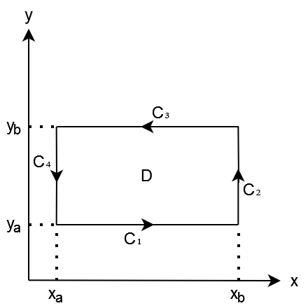
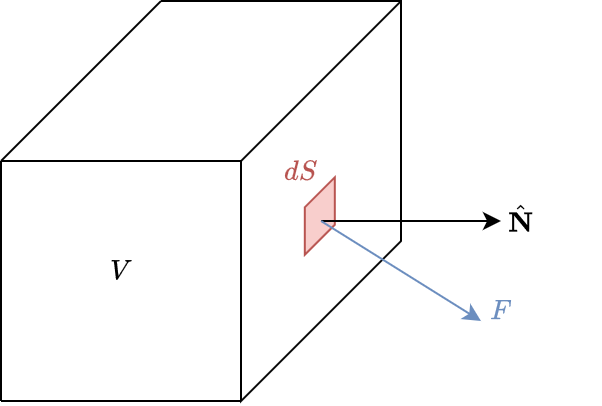
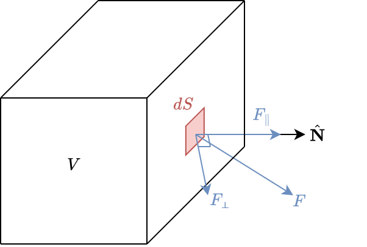

# 1
> $\mathbb{R}^n$ är ett fullständigt rum

Relevanta definitioner:
> **Kontraktion**
> $g$ är en kontraktion $\iff$ $||g(x) - g(y)|| \leq L_g||x-y||$

> **Banachs Fixxpunktssats**
> Antag att $g : A \to A$ är en kontraktionsavbildning på den slutna mängden $A \in \mathbb{R}^n$, dvs
>
> $||g(x) - g(y)|| \leq L_g||x-y||\quad \forall x,y \in A,\quad L_g < 1$
>
> Då har g en unik fixpunkt i A, det vill säga
>
> $\exists! \bar{x} \in A : \bar{x} = g(\bar{x})$
>
> Fixpunkten fås som gränsvärde av fixpunktsiterationen $x_{j+1} = g(x_j)$ med $x_0 \in A$

> **Cauchy följd**
> $(x_k)^\infty_{k=0}$ är en cauchy-följd
> $\implies (x_k)^\infty_{k=0}$ konverget
> $\iff \exists! \bar{x} : \bar{x} \in X$ där $(\bar{x} = g(\bar{x}))$
> $x_{k+1} = g(x_k)$

> **Fullständigt rum**
> TODO

För $\mathbb{R}^n$ blir således frågan ekvivalent med att bevisa att banach fixbunktsats stämmer för $\mathbb{R}^{n}$:
≈ För varje punkt $\bar{x}$ i $\mathbb{R}^n$ existerar en och endast en $\bar{x}$ där någon kontraktion $g \in \mathbb{R}^{n} \to \mathbb{R}^{n}$ har $\bar{x}$ som en fixpunkt, (att den mappar till sig själv)

**Bevis:**

> RE:
> $x_{j+1} = g(x_j)$

Vi vill visa att:
$||g(x)-g(y)|| \leq L_g||x - y||$ 
$||g(x_j)-g(x_k)|| \leq L_g||x_j - x_k||$ (där $j>k$)
$||x_{j+1}-x_{k+1}|| \leq L_g||x_{j} - x_{k}||$ (där $j>k$)

Först, skriv genom triangelolikheten
$||x_{j+1}-x_{k+1}|| \leq L_g\sum_{i=k+1}^{j}||x_1-x_0||$

Om vi analyserar varje del av summan
$||x_{i+1}-x_{i+0}|| \leq L_g||x_{i+0} - x_{i-1}||$
$||x_{i+0}-x_{i-1}|| \leq L_g||x_{i-1} - x_{i-2}||$
$||x_{i-1}-x_{i-2}|| \leq L_g||x_{i-2} - x_{i-3}||$
$||x_{i-2}-x_{i-3}|| \leq L_g||x_{i-3} - x_{i-4}||$
$...$
$||x_{2}-x_{1}|| \leq L_g||x_{1} - x_{0}||$

Genom att komberina höger och vänster led får vi
$||x_{i+1}-x_{i}|| = L_g^i||x_{1} - x_{0}||$

Sätt tillbaka detta förenklade uttryck i summan
$||x_{j+1}-x_{k+1}|| \leq L_g\sum_{i=k+1}^{j}L_g^i||x_{1} - x_{0}||$

Summan av en geometrisk serie kan skrivas om
$||x_{j+1}-x_{k+1}|| \leq \frac{L_g(L_g^j-L_g^k)}{L_g-1}||x_0-x_1||$
$||x_{j+1}-x_{k+1}|| \leq \frac{(L_g^{j+1}-L_g^{k+1})}{L_g-1}||x_0-x_1||$
$||x_{j+1}-x_{k+1}|| \leq \frac{L_g^{k+1}(1-L_g^{j-k})}{1-L_g}||x_0-x_1||$

$||x_{j}-x_{k}|| \leq \frac{L_g^{k}(1-L_g^{j-k-1})}{1-L_g}||x_0-x_1||$

Då $L$ är mellan 0 och 1 går faktorn före $||x_1-x_0||$ tydligt mot oändligheten, vi kan altid hitta j/k som uppfyller att g är en kontraktion kriteriet.

# 2 Leibniz regel
> I flervariabelanalys definieras produktregeln som
$\large \frac{\partial h}{\partial x_i}
= \frac{\partial}{\partial x_i}(f \cdot g)
= \frac{\partial f}{\partial x_i} \cdot g + f \cdot \frac{\partial g}{\partial x_i}$
$\large \frac{\partial h}{\partial x_i}
= \frac{\partial}{\partial x_i}(f(x) \cdot g(x))
= \frac{\partial f}{\partial x_i} \cdot g(x) + f(x) \cdot \frac{\partial g}{\partial x_i}$
> Där $x \in \mathbb{R}^n$ och $f, g \in \mathbb{R}^n \to \mathbb{R}$

**Bevis**

> RE: Definitionen av Derivatan
$\large \frac{\partial h}{\partial x_i} = \lim_{h \to 0} \frac{f(\bar{x}+h) - f(\bar{x})}{h}$
$\large \iff \lim_{h \to 0} \frac{f(\bar{x}+h) - f(\bar{x}) - f'(\bar{x})}{h} = 0$

$\large \frac{\partial h}{\partial x_i} = \frac{\partial}{\partial x_i}(f(x) \cdot g(x))$

$\large= \lim_{h \to 0} \frac{ f(x_1, ..., x_i + h, ..., x_n) \cdot g(x_1, ..., x_i + h, ..., x_n) - f(x_1, ..., x_i, ..., x_n) \cdot g(x_1, ..., x_i, ..., x_n) }{h}$

$\large= \lim_{h \to 0} \frac{f(x_1, ..., x_i + h, ..., x_n) - f(x_1, ..., x_i, ..., x_n)}{h} \cdot g(x_1, ..., x_i, ..., x_n)$
$\quad\large+ f(x_1, ..., x_i, ..., x_n) \cdot \frac{g(x_1, ..., x_i + h, ..., x_n) - g(x_1, ..., x_i, ..., x_n)}{h}$

Då vi förutsätter att derivatan exisiterar och inte är oändlig kan vi separera $\lim(a+b) \to (\lim a)+(\lim b)$
$\large= \left( \lim_{h \to 0} \frac{f(x_1, ..., x_i + h, ..., x_n) - f(x_1, ..., x_i, ..., x_n)}{h} \cdot g(x_1, ..., x_i, ..., x_n) \right)$
$\quad\large+ \left( \lim_{h \to 0}f(x_1, ..., x_i, ..., x_n) \cdot \frac{g(x_1, ..., x_i + h, ..., x_n) - g(x_1, ..., x_i, ..., x_n)}{h} \right)$

Vi kan ta ut delarna operoende av h utanför limiten
$\large= \left( \lim_{h \to 0} \frac{f(x_1, ..., x_i + h, ..., x_n) - f(x_1, ..., x_i, ..., x_n)}{h} \right) \cdot g(x_1, ..., x_i, ..., x_n)$
$\quad\large+ f(x_1, ..., x_i, ..., x_n) \cdot \left( \lim_{h \to 0} \frac{g(x_1, ..., x_i + h, ..., x_n) - g(x_1, ..., x_i, ..., x_n)}{h} \right)$

Dom $\lim$ som är kvar är identiska med de gränsvärdesdefinitionerna för egenstående partiella derivator.

$
\frac{\partial h}{\partial x_i} = \frac{\partial f}{\partial x_i} \cdot g + f \cdot \frac{\partial g}{\partial x_i}
$

# 3 Taylors sats
> Antag $f : \mathbb{R}^n \to \mathbb{R}$ har kontinuerliga partiella derivator av ordning 3 i en omgivning av punkten $\bar{x}$. Då gäller Taylors formel för alla $x$ i denna omgivning, dvs:
>
> $f(x) = f(\bar{x}) + f'(\bar{x})h + \frac{1}{2}h^Tf''(\bar{x})h+E_2[f, \bar{x}](x)$ där $h=x-\bar{x}$
>
> Där resttermen uppfyller olikheten $|E[f,\bar{x}](x)| \le K||h||^3$ med $K = c_n max|f^{'''}_{ijk}(\zeta)|$ där maximum tas med avseende på $i, j, k$ och med avseende på alla $i$ den nämnda omgivningen.
>
> Polynomet
> $P_2[f,\bar{x}](x) = f(\bar{x}) + f'(\bar{x})(x-\bar{x}) + \frac{1}{2}(x-\bar{x})^Tf''(\bar{x})(x-\bar{x})$
> kallas Taylors polynom för $f$ i punkten $\bar{x}$.

> RE: Taylor för $x \in \mathbb{R}, F \in \mathbb{R} \to \mathbb{R}$
2: $F(x) = F(\bar{x}) + F'(\bar{x})(x-\bar{x}) + \frac{1}{2}F''(\bar{x})(x-\bar{x})^2 + E_2[F, \bar{x}](x)$
där $E_2[F, \bar{x}](x) = \frac{1}{6}F'''(s)(x-\bar{x})^3$ för något $s \in [x, \bar{x}]$
Taylor aproximeringen av funktionen $F$ taylor evaluaringen för punkten $\bar{t}$

Nu vill vi bevisa andra ordnings taylor för $f \in \mathbb{R}^n \to \mathbb{R}$

**Variabler**

$x \in \mathbb{R}^n$
$\bar{x} \in \mathbb{R}^n$
$h \in \mathbb{R}^n$
där $x = \bar{x} + h \iff h = x - \bar{x}$

$f \in \mathbb{R}^n \to \mathbb{R}$

**Bevis**

**1) Linarisera problemet**

låt $X(t) = f(\bar{x} + th)$ där $t\in\mathbb{R}, X\in\mathbb{R}\to\mathbb{R}$
Med denna får vi:
$X(0) = f(\bar{x})$ och
$X(1) = f(\bar{x}+h) = f(x)$
På så vis kan vi förhoppnings hitta en generell lösning runt $\bar{x}$ utan att behöva specificera riktiningen på h.

**2) Taylor för $X$**

Om vi sen löser taylor av $X$ vid punkten 0 så har vi också löst taylor expansionen runt $\bar{x}$ för $f$
$X(t) = X(\bar{t}) + X'(\bar{t})(t-\bar{t}) + \frac{1}{2}X''(\bar{t})(t-\bar{t})^2 + E_2[X, \bar{t}](t)$
$X(t) = X(0) + X'(0)(t-0) + \frac{1}{2}X''(0)(t-0)^2 + E_2[X, 0](t)$
$X(t) = X(0) + X'(0)t + \frac{1}{2}X''(0)t^2 + E_2[X, 0](t)$

**3) Lös X'**

$X'(t) = \frac{d}{dt}f(\bar{x} + th) = f'_1(\bar{x} + th)h_1 + f'_2(\bar{x} + th)h_2 + \cdots + f'_n(\bar{x} + th)h_n$
$X'(0) = f'_1(\bar{x})h_1 + f'_2(\bar{x})h_2 + \cdots + f'_n(\bar{x})h_n$
$= \begin{bmatrix}
f'_1(\bar{x}), f'_1(\bar{x}), \cdots , f'_n(\bar{x})
\end{bmatrix} \cdot {\tiny\begin{bmatrix}
h_1 \\
h_2 \\
\vdots \\
h_n
\end{bmatrix}}$
Om vi definierar $f'(\bar{x})$ som radvektorn av $f'$s får vi:
$X'(0) = f'(\bar{x})h$

**4) Lös X''**

$X''(t) = \frac{d}{dt}^2X(t) = \frac{d}{dt}X'(t)$
$= \frac{d}{dt}(f'_1(\bar{x} + th)h_1 + f'_2(\bar{x} + th)h_2 + \cdots + f'_n(\bar{x} + th)h_n)$
Applicera kedjereglen och summera
$= f''_{11}(\bar{x} + th)h_1h_1 + f''_{12}(\bar{x} + th)h_1h_2 + \cdots + f''_{1n}(\bar{x} + th)h_1h_n$
$+ f''_{21}(\bar{x} + th)h_2h_1 + f''_{22}(\bar{x} + th)h_2h_2 + \cdots + f''_{2n}(\bar{x} + th)h_2h_n$
$+ \dots$
$+ f''_{n1}(\bar{x} + th)h_nh_1 + f''_{n2}(\bar{x} + th)h_nh_2 + \cdots + f''_{nn}(\bar{x} + th)h_nh_n$

$X''(0)$
$= f''_{11}(\bar{x})h_1h_1 + f''_{12}(\bar{x})h_1h_2 + \cdots + f''_{1n}(\bar{x})h_1h_n$
$+ f''_{21}(\bar{x})h_2h_1 + f''_{22}(\bar{x})h_2h_2 + \cdots + f''_{2n}(\bar{x})h_2h_n$
$+ \dots$
$+ f''_{n1}(\bar{x})h_nh_1 + f''_{n2}(\bar{x})h_nh_2 + \cdots + f''_{nn}(\bar{x})h_nh_n$

Detta går att förenkla till
$=\begin{bmatrix}
h_1, h_2, \cdots, h_n
\end{bmatrix}
\cdot
\begin{bmatrix}
f''_{11}(\bar{x}) & f''_{12}(\bar{x}) & \cdots & f''_{1n}(\bar{x}) \\
f''_{21}(\bar{x}) & f''_{22}(\bar{x}) & \cdots & f''_{2n}(\bar{x}) \\
\vdots & \vdots & \ddots & \vdots \\
f''_{n1}(\bar{x}) & f''_{n2}(\bar{x}) & \cdots & f''_{nn}(\bar{x}) \\
\end{bmatrix}
\cdot
\begin{bmatrix}
h_1 \\ h_2 \\ \vdots \\ h_n
\end{bmatrix}$
Om vi definierar $f''(\bar{x})$ som matrisen av $f''$s får vi:
$X''(0) = h^Tf''(\bar{x})h$

**5) Lös ut f(x)**

> RE:
$X(t) = X(0) + X'(0)t + \frac{1}{2}X''(0)t^2 + E_2[X, 0](t)$
$X(t) = f(\bar{x} + th)$
$X(0) = f(\bar{x})$
$X(1) = f(\bar{x}+h)$

$f(x) = f(\bar{x}+h) = X(1)$
$\begin{array}{llllllllll}
   =& X(0)       &+& X'(0)1       &+& \frac{1}{2}X''(0)1^2        &+& E_2[X, 0](1) \\
   =& f(\bar{x}) &+& f'(\bar{x})h &+& \frac{1}{2}h^Tf''(\bar{x})h &+& E_2[X, 0](1) \\
   =& f(\bar{x}) &+& f'(\bar{x})h &+& \frac{1}{2}h^Tf''(\bar{x})h &+& E_2[f, \bar{x}](x)
\end{array}$

**6) Motivera Resttermen**

Vi vill visa att: $|E[f,\bar{x}](x) \le K||h||^3$ med $K = c_n max|f^{'''}_{ijk}(\zeta)|$

 

> RE:
> $E_2[X, \bar{t}](t) = \frac{1}{6}X'''(s)(t-\bar{t})^3 \quad$ där $s \in [t, \bar{t}]$

$E_2[X, 0](1) = \frac{1}{6}X'''(s)(1-0)^3 = \frac{1}{6}X'''(s) \quad$ där $s \in [0, 1]$

$X'''(t) = \frac{d}{dt}{\Big(}$
$\quad f''_{11}(\bar{x} + th)h_1h_1 + f''_{12}(\bar{x} + th)h_1h_2 + \cdots + f''_{1n}(\bar{x} + th)h_1h_n$
$\quad + f''_{21}(\bar{x} + th)h_2h_1 + f''_{22}(\bar{x} + th)h_2h_2 + \cdots + f''_{2n}(\bar{x} + th)h_2h_n$
$\quad + \dots$
$\quad + f''_{n1}(\bar{x} + th)h_nh_1 + f''_{n2}(\bar{x} + th)h_nh_2 + \cdots + f''_{nn}(\bar{x} + th)h_nh_n$
${\Big)}$
Detta uttryck skulle bli extremt långt så jag introducerar en alias för partiel derivivering för den i:te dimensionen:
$k_i(\bar{x}+th) =$
$\quad   f'''_{11i}(\bar{x} + th)h_1h_1h_i + f'''_{12i}(\bar{x} + th)h_1h_2h_i + \cdots + f'''_{1ni}(\bar{x} + th)h_1h_nh_i$
$\quad + f'''_{21i}(\bar{x} + th)h_2h_1h_i + f'''_{22i}(\bar{x} + th)h_2h_2h_i + \cdots + f'''_{2ni}(\bar{x} + th)h_2h_nh_i$
$\quad + \dots$
$\quad + f'''_{n1i}(\bar{x} + th)h_nh_1h_i + f'''_{n2i}(\bar{x} + th)h_nh_2h_i + \cdots + f'''_{nni}(\bar{x} + th)h_nh_nh_i$

Med detta blir:
$X'''(t) = {\large\Sigma_{i=1}^n} k_i(\bar{x}+th)$

Om vi introducerar: $\zeta = \bar{x}+sh$ Får vi
$X(s) = f(\zeta)$
$X'''(s) = {\large\Sigma_{i=1}^n} k_i(\zeta)$

> RE: vi vill hitta storleken av
> $E_2[f, \bar{x}](x) = E_2[X, 0](1) = \frac{1}{6}X'''(s)$

Detta innebär att $X'''(s)$ är en lång skalärprodukt mellan $[f^{'''}_{ijk}(\zeta), \cdots]$ och $[h_xh_yh_z, \cdots]$
Det betyder att det största\* värdet möjliga värdet som kan ges av $X'''(s)$ är :
**Antalet summerade element** $\cdot$ **Största möjliga** $f^{'''}_{ijk}(\zeta)$ $\cdot$ **Största möjliga** $h_xh_yh_z$ `(PROP 1)`
(\*Med största i denna bemärkelse menar jag största absolutbelopp)

**Antalet summerade element** $= n^3$
**Största möjliga** $f^{'''}_{ijk}(\zeta) = max|f^{'''}_{ijk}(\zeta)|$
**Största möjliga** $h_xh_yh_z$ $= c \cdot ||h||^3$ där $c \le 1$

Om man flyttar runt $\frac{1}{6}$, $c$ och $n^3$ konstanterna så att dom räknas in i $K$ in är det enkelt att se att `(PROP 1)` är ekvivalent med det beviset efterfrågar:
> $|E_2[f,\bar{x}](x)| \le K||h||^3$ med $K = c_n max|f^{'''}_{ijk}(\zeta)|$

**7) Resultat**

Vi har i steg 5 visat att:
$f(x) = f(\bar{x}+h) = X(1)$
$= f(\bar{x}) + f'(\bar{x})h + \frac{1}{2}h^Tf''(\bar{x})h + E_2[X, 0](1)$
$= f(\bar{x}) + f'(\bar{x})h + \frac{1}{2}h^Tf''(\bar{x})h + E_2[f,\bar{x}](x)$

där $f'(x) = \begin{bmatrix}
f'_1(\bar{x}), f'_1(\bar{x}), \cdots , f'_n(\bar{x})
\end{bmatrix}$
och $f''(x) =\begin{bmatrix}
f''_{11}(\bar{x}) & f''_{12}(\bar{x}) & \cdots & f''_{1n}(\bar{x}) \\
f''_{21}(\bar{x}) & f''_{22}(\bar{x}) & \cdots & f''_{2n}(\bar{x}) \\
\vdots & \vdots & \ddots & \vdots \\
f''_{n1}(\bar{x}) & f''_{n2}(\bar{x}) & \cdots & f''_{nn}(\bar{x}) \\
\end{bmatrix}$
(Hesse-matrisen)

Och sen i steg 6 har vi visat att:
$|E_2[f,\bar{x}](x)| \le K||h||^3$ med $K = c_n max|f^{'''}_{ijk}(\zeta)|$

# 4 Existens av skalär potential

> RE: Definition Konservativt
> Ett vektorfäkt $\bf{F}$ kallas konservativt i $D$ om det finns ett skalärt fänt $\phi$ sådant att:
>
> $\bf{F} = \nabla\phi \quad$ i $D$
>
> Fältet $\phi$ kallas då *potential* till $\bf{F}$

**Sats att bevisa**
> RE: Sats Tillräckligt vilkor för potential
> Antag att $\nabla \times {\bf{F}} = {\bf{0}}$ i ett enkelt sammangängande område $D$, Då är $\bf{F}$ konservativt, dvs det finns ett deriverbart fält $\phi$ sådant att ${\bf{F}} = \nabla\phi$ i $D$

**Bevis**

**1) $\phi$:s form**
Vi blörjar att använda Stoke theorem:
> RE:
> ${\bf S}$ är en yta
> $C$ är kantkurvan av ${\bf S}$ där $t$ går längs kurvan.
> $\iint_{\bf S}(\nabla \times {\bf F}) \cdot d{\bf S} = \int_C {\bf F} \cdot dt$

Sätter in $\nabla \times {\bf{F}} = {\bf{0}}$:
$\iint_{\bf S}({\bf 0}) \cdot d{\bf S} = \int_C {\bf F} \cdot dt$
$0 = \int_C {\bf F} \cdot dt$

Stokes stats visar att om vi ingegrarar runt kanten av en form i $\bf F$ får vi alltid skalären 0, oavsett vilken väg vi tar.
Vi delar upp sträckan i två delsträckor: $A$ och $B$. Om man integrerar längs båda efter varandrar får man 0.
$A$ från punkt $P$ till punkt $Q$
$B$ från punkt $Q$ till punkt $P$

Det interesanta här är hela varvet får kurvintegralen=0 oavsett formen av A (och/eller B).
⇒ Alla möjliga vägar fråm $P$ till $Q$ måste resultera i samma storlek av dess kurvintegral.

Således betyder det att om vi hittar **någon** $\phi$-kurva mellan två generiska startpunkter som visar $\bf{F} = \nabla\phi$ måste det påståendet också stämma för alla kurvor. (Så länge som $D$ är sammanhängande, vilket det är)

**2) Definiera $\phi$ kurvan**

låt definiera $\phi$ som en godtycklig kurva mellan a och b i $\mathbb{R}^3$.
Skalären t bestämmer hur långt vi har gått från a till b längds med någon väg.
$\phi = \int_a^b {\bf F} \cdot dt$

Vi vill visa att vi kan hitta $a$, $b$ och vägen där imellan så att $\bf{F} = \nabla\phi$.

Vi vill visa:
$\nabla\phi = (\frac{\partial\phi}{\partial x}, \frac{\partial\phi}{\partial y}, \frac{\partial\phi}{\partial z})
 \stackrel{?}{=} ({\bf F}_1, {\bf F}_2, {\bf F}_3) = {\bf F}$

**Hitta $\frac{\partial\phi}{\partial x}$**

$\large\frac{\partial\phi}{\partial x} = \lim_{h\to0}\frac{\phi(x+h,y,z)-\phi(x,y,z)}{h}$

Om vi väljer
$a = (x_0, y, z), b = (x_0+h, y, z)$

$\large\frac{\partial\phi}{\partial x} = \lim_{h\to0}\frac{
   \left({\large\int_{x_0,y,z}^{x_0+h,y,z}} {\bf F} \cdot dt\right)
   -\left({\large\int_{x_0,y,z}^{x_0,y,z}} {\bf F} \cdot dt\right)
}{h}$
$\large\frac{\partial\phi}{\partial x} = \lim_{h\to0}\frac{
   {\large\int_{x_0,y,z}^{x_0+h,y,z}} {\bf F} \cdot dt
}{h}$
Då vi endast rör oss längs kan vi förenkla x-axeln
$\large\frac{\partial\phi}{\partial x} = \lim_{h\to0}\frac{
   {\large\int_{x_0}^{x_0+h}} {\bf F_1}(x,y,z) \cdot dx
}{h}$
Detta uttryck representerar att ta derivatan av integralen, dessa tar ut varandra
> ⚠️ föutsatt att båda är väldefinierade, vilket vi antar att dom är.

Kvar blir:
$\frac{\partial\phi}{\partial x} = {\bf F_1}(x,y,z)$

**Hitta $\frac{\partial\phi}{\partial y}$ & $\frac{\partial\phi}{\partial z}$**
om vi väljer
$a = (x, y_0, z), b = (x, y_0+h, z)$ repektive $a = (x, y, z_0), b = (x, y, z_0+h)$
kan vi göra samma sak som för $\frac{\partial\phi}{\partial x}$ för att visa att varje väg leder till ekvivalens med repektive ${\bf F}$

**Slutsats**
Vi har visat att
$\nabla\phi = (\frac{\partial\phi}{\partial x}, \frac{\partial\phi}{\partial y}, \frac{\partial\phi}{\partial z})
= ({\bf F}_1, {\bf F}_2, {\bf F}_3) = {\bf F}$

# 5 Analysens fundamentalsats i flera variabler
> RE: i en variabel
> $\int^b_af(x)dx = F(b)-F(a) = \left[F(x)\right]^b_a$

**Sats att bevisa**
> $\int_C {\bf F} \cdot dr = \phi(r(b)) - \phi(r(a))$
> Givet att ${\bf F}$ är konservativt i $D$ ⇔ $({\bf F} = \nabla \phi)$

**Bevis:**
$\int_C {\bf F} \cdot dr$
Är per definition *(Definition 5.3 (Tangentkurvintegral))*
$= \int_a^b {\bf F}(r(t)) \cdot r'(t)dt$
Applicera konservativt i $D$ kriteriet.
$= \int_a^b \nabla \phi(r(t)) \cdot r'(t)dt$

> RE: $\nabla$
> $\nabla\phi(r(t)) = \Big(
   \frac{\partial\phi}{\partial x}(r(t)),
   \frac{\partial\phi}{\partial y}(r(t)),
   \frac{\partial\phi}{\partial z}(r(t))
   \Big)$
> RE: Kedjeregeln
> $\frac{d}{dt} \phi(r(t))$
> $= \Big(
   \frac{\partial\phi}{\partial x}(r(t))\frac{\partial r}{\partial x}r(t),
   \frac{\partial\phi}{\partial y}(r(t))\frac{\partial r}{\partial y}r(t),
   \frac{\partial\phi}{\partial z}(r(t))\frac{\partial r}{\partial z}r(t)
  \Big)$
> $= \nabla\phi(r(t)) \cdot r'(t)$

Substituera kedjeregeln baklänges
$= \int_a^b \frac{d}{dt}\phi(r(t))dt$

Nu har vi integralen av en derivata, så vi kan använda envariabelens fundamentalsats
Mer precis har vi $\int^b_af'(t)dt = f(b)-f(a)$ där $f(t) = \phi(r(t))$,

Kvar får vi då
$= \phi(r(b)) - \phi(r(a))$

Vilket är precis vad vi ville bevisa.

# 6 Greens Sats
Greens sats fanns inte med i 2019 boken, denna definition (och bevisinspiration) är tagen från wikipedia + khan academy.

> RE: kurvintegral def
> $\int_C f\ ds = \int_a^b f(r(t))||r'(t)||dt$
> där $ds = ||r'(t)||dt$
> där $r(t)$ är en parametrisering av $C$
>
> För 2D: $||r'(t)|| = \sqrt{(\frac{dx}{dt})^2+(\frac{dy}{dt})^2}$

> RE: Ytinegral def
> $\iint_S f\ dS = \iint_D f(r(x,y)) ||\frac{\partial r}{\partial x}(x,y) \times \frac{\partial r}{\partial y}(x,y)||dxdy$
där $ds = ||\frac{\partial r}{\partial x}(x,y) \times \frac{\partial r}{\partial y}(x,y)||dxdy$
>
> Och ytan:
> $A = \iint_D||\frac{\partial r}{\partial x}(x,y) \times \frac{\partial r}{\partial y}(x,y)||dxdy$

**Sats att bevisa:**
> $\int_C (Pdx + Qdy) = \iint_D (\frac{\partial P}{\partial x} - \frac{\partial Q}{\partial y})dxdy$
> Där $\int_C$ är en kurvintegral **motsols** längs med kantent av ytan $D$.
> Där $P, Q \in \mathbb{R}^2 \to \mathbb{R}$

**Bevis**
Beviset delas upp i olika former

**1.1) Konvex**
Låt oss börja med att bevisa greens för en konvex region utan lodräta eller vågräta linjer D med kurvan C

$\int_C (Pdx + Qdy) = (\int_C Pdx) + (\int_C Qdy)$

**1.2) Pdx**
Vi börjar med $\int_C Pdx$ och genom att kurvan i två delar som kan parametriseras av x (detta är varför kurvan måste vara konvex utan lodräta/vågräta linjer. Om så hade varit fallet hade fler än två delar behövts)

$\int_C P(x,y)dx = {\int_C}_1 P(x,y)dx + {\int_C}_2 P(x,y)dx$

$= \Big( \int_a^b P(x, y_1(x))dx \Big) + \Big( \int_b^a P(x, y_2(x))dx \Big)$
$= \Big( \int_a^b P(x, y_1(x))dx \Big) - \Big( \int_a^b P(x, y_2(x))dx \Big)$
$= \int_a^b \Big(P(x, y_1(x)) - P(x, y_2(x))\Big)dx$
$= -\int_a^b \Big(P(x, y_2(x)) - P(x, y_1(x))\Big)dx$
$= -{\large\int_a^b} \Big[P(x,y)\Big]_{y=y_1(x)}^{y=y_2(x)}dx$
Förutsatt att derivatan existerar är kan vi göra en en bekant substitution:
$= -{\large\int_a^b} \Big( {\large\int_{y_1(x)}^{y_2(x)}} \frac{\partial P}{\partial y} dy \Big)dx$
$= -{\large\int_a^b} {\large\int_{y_1(x)}^{y_2(x)}} \frac{\partial P}{\partial y} dydx$

Detta är en ytintegral, och ytan som integreras över ${\large\int_a^b}{\large\int_{y_1(x)}^{y_2(x)}}$ är lika med $D$.
> ⚠️ Detta funkar då vi tog ut inverterade integrationsgränserna och tog ut minus före uttrycket. ${\large\int_a^b} {\large\int_{y_2(x)}^{y_1(x)}}$ är **inte** samma som $D$!

$= -\iint_D \frac{\partial P}{\partial y} dydx$

**1.3) Qdy**
Nu gör vi något liknande för $\int_C Qdy$
> ⚠️ $a,b,c_1,c_2$ har helt annan innebörd här!

$\int_C Q(x,y)dy = {\int_C}_1 Q(x,y)dy + {\int_C}_2 Q(x,y)dy$

$= \Big( \int_a^b Q(x_1(y), y)dy \Big) + \Big( \int_b^a Q(x_2(y), y)dy \Big)$
$= \Big( \int_a^b Q(x_1(y), y)dy \Big) - \Big( \int_a^b Q(x_2(y), y)dy \Big)$
$= \int_a^b \Big(  Q(x_1(y), y) - Q(x_2(y), y) \Big) dy$
$= {\large\int_a^b} \Big[Q(x,y)\Big]_{x=x_2(y)}^{x=x_1(y)}dy$
> ⚠️ Vi tar från $x_2 \to x_1$ inte $y_1 \to y_2$ som vi gjorde för $P$ så inget minus behövs!

Förutsatt att derivatan existerar är kan vi göra en en bekant substitution:
$= {\large\int_a^b} \Big( {\large\int_{x_2(x)}^{x_1(x)}} \frac{\partial Q}{\partial x} dx \Big)dy$
$= {\large\int_a^b} {\large\int_{x_2(x)}^{x_1(x)}} \frac{\partial Q}{\partial x} dxdy$

Detta är en ytintegral, och ytan som integreras över är igen lika med $D$

$= \iint_D \frac{\partial Q}{\partial x} dxdy$

**1.4) Sätt ihop**
$\int_C (Pdx + Qdy) = (\int_C Pdx) + (\int_C Qdy)$
$= -\iint_D \frac{\partial P}{\partial y} dydx + \iint_D \frac{\partial Q}{\partial x} dxdy$
Då vi har tagit bort parametriseringen av $D$ är det ok att byta ordning på $dx$ och $dy$. (båda ordningar är lika med $dD$)
$= -\iint_D \frac{\partial P}{\partial y} dxdy + \iint_D \frac{\partial Q}{\partial x} dxdy$
Samma integrationsarea, så vi kan kombinera:
$= \iint_D \Big(-\frac{\partial P}{\partial y}+\frac{\partial Q}{\partial x} \Big) dxdy$
$= \iint_D \Big( \frac{\partial Q}{\partial x}-\frac{\partial P}{\partial y} \Big) dxdy$

Vilket är det vi ville bevisa!

**2.1) Rektanglar**
Låt oss nu bevisa greens för en rektangel bestående av lodräta och vågräta linjer som bildar formen D med kurvan C

> RE:
> $\int_C (Pdx + Qdy) = (\int_C Pdx) + (\int_C Qdy)$

**2.2) Pdx**

$\int_C Pdx = \int_C P(x,y)dx$
$= {\int_C}_1 P(x,y)dx + {\int_C}_2 P(x,y)dx + {\int_C}_3 P(x,y)dx + {\int_C}_4 P(x,y)dx$

Då $x$ inte ändras längs $C_4/C_2$ är dessa integationen längs dessa lika med noll.
$\int_C Pdx = \int_C P(x,y)dx = {\int_C}_1 P(x,y)dx + {\int_C}_3 P(x,y)dx$
$= {\int_C}_1 P(x,y_a)dx + {\int_C}_3 P(x,y_b)dx$

Uttrycket vi får är identiskt med det för konvexa icke lod/vågräta former förutom att dom innan komplicerade $y_1(x)$ och $y_2(x)$ nu bara är konstanter. Åter igen får vi:
$= -\iint_D \frac{\partial P}{\partial y} dydx$

**2.3) Qdy**

$\int_C Qdx = \int_C Q(x,y)dy$
$= {\int_C}_1 Q(x,y)dy + {\int_C}_2 Q(x,y)dy + {\int_C}_3 Q(x,y)dy + {\int_C}_4 Q(x,y)dy$

Då $y$ inte ändras längs $C_1/C_3$ är dessa integationen längs dessa lika med noll.
$\int_C Qdx = \int_C Q(x,y)dx = {\int_C}_2 Q(x,y)dy + {\int_C}_4 Q(x,y)dy$
$= {\int_C}_2 Q(x_a,y)dy + {\int_C}_4 P(x_b,y)dy$

Uttrycket vi får är identiskt med det för konvexa icke lod/vågräta former förutom att dom innan komplicerade $x_1(y)$ och $x_2(y)$ nu bara är konstanter. Åter igen får vi:
$= \iint_D \frac{\partial Q}{\partial x} dxdy$

**2.4) Sätt ihop**
Då vi fick samma resultat av 2.2 och 2.3 som 1.2 och 2.3 får vi med identiskt resonemang:
$\int_C (Pdx + Qdy) = \iint_D \Big( \frac{\partial Q}{\partial x}-\frac{\partial P}{\partial y} \Big) dxdy$$

**3) Generallisering för alla ytor**
För en komplicerad figur kan man dela upp den i små delar och visa att green stämmer för alla delar individuellt. Alla ytor kan konstrueras genom att sätta ihop flera konvexa figurer utan lodräta/vågräta linjer samt lodräta/vågräta rektanglar.

> Detta känns väldigt intuitivt men jag kommer inte på hur man formellt bevisar att så är fallet. Känns som det ligger utanför kursen?

**TODO: fixaså det är mer som wikipedia med formen**

# 7 Gauss sats

> RE: Slät yta
> En yta S kallas slät (eller glatt) om det finns ett kontinuerligt varierande enhetsnrmalvektorfält i varje punkt på ytan. Med andra ord: det ska finnas en parametrisering så att:
> $$\hat{\bf N} = \pm \frac{r'_u \times r_v'}{||r'_u \times r_v'||}$$
> existerar (⇔ $r'_u \times r_v' \ne \bf 0$).
> Man kan då välja en orientering av ytan. Ytan är en *styckvis slät orienterad yta* om den är hopskarvat av släta orienterade ytor så att orienteringarna från båda sidor av skavaen stämmer överäns
> Obs. $\hat{\bf N}$ behöver inte vara definiera på skarven mellan ytorna.

**Sats att bevisa**
> $\iiint_D \nabla \cdot {\bf F}dV = \iint_S \hat{\bf N} \cdot {\bf F}dS$
> Där D är en begränsad mängd i ${\Bbb R}^3$ vars rand är en styckvis slät orienterad yta S med ett utåtriktat enhetsnormalvektorfält $\hat{\bf N}$.
> Där $\bf F$ är ett vektorfält med kontinuerlig derivata i D

**Bevis**

**1.1) Dela $\iiint_D$**
> RE:
> $\nabla \cdot {\bf F} = (\frac{\partial}{\partial x}, \frac{\partial}{\partial y}, \frac{\partial}{\partial z})\cdot(F_1, F_2, F_3) = \frac{\partial F_1}{\partial x} + \frac{\partial F_3}{\partial y} + \frac{\partial F_2}{\partial z} = div{\bf F}$

$\large \iiint_D \nabla \cdot {\bf F}dV$
$\large =\iiint_D (\frac{\partial F_1}{\partial x} + \frac{\partial F_2}{\partial y} + \frac{\partial F_3}{\partial z})dV$
$\large =(\iiint_D \frac{\partial F_1}{\partial x}dV) + (\iiint_D \frac{\partial F_2}{\partial y}dV) + (\iiint_D \frac{\partial F_3}{\partial z}dV)$

**2.2) Dela $\iint_S \hat{\bf N} \cdot {\bf F}dS$**
$\large \iint_S \hat{\bf N} \cdot {\bf F}dS$
$\large \iint_S (\hat{\bf N}_1 F_1 + \hat{\bf N}_2 F_2 + \hat{\bf N}_3 F_3)dS$
$\large (\iint_S \hat{\bf N}_1 F_1 dS) + (\iint_S \hat{\bf N}_2 F_2 dS) + (\iint_S \hat{\bf N}_3 F_3 dS)$

  
**Insikt i $\hat{\bf N} \cdot {\bf F}dS$**

$\hat{\bf N}$ är en vektor som är **utåtriktad** från volymens yta där riktningen är ortagonal med ytan.

Dela upp $F$ till det som är parallellt/ortagonalt med $\hat{\bf N}$

$\large \hat{\bf N} \cdot {\bf F}dS = \hat{\bf N} \cdot ({\bf F}_\parallel + {\bf F}_\perp) dS$
$= (\hat{\bf N} \cdot {\bf F}_\parallel + \hat{\bf N} \cdot {\bf F}_\perp) dS$

Skalärprodukten med en ortagonal vektor är alltid noll
$= \hat{\bf N} \cdot {\bf F}_\parallel dS$

$dS$ är ortagonal till $\hat{\bf N}$ och ${\bf F}_\parallel$