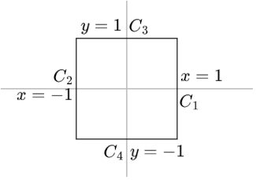

# 7.1 Lös advektion-diffution-ekvationen
*I det här problemet får du lösa advektion-diffution-ekvationen med finita element metoden och studera lösningens konvergens när $h \to 0$.*

> ⚠️ För att vara konsekvent med uppgiftsbeskrivningen används $\nabla$ här för att skapa kolumnvektorer. (i föregående uppgifter användes radvektorer, antar att boken ändrat praxis sen 2019)

## a)
Betrakta advektion-diffution-ekvationen $-\varepsilon \Delta u + \beta \cdot \nabla u = f$ med homogena Dirichlet-vilkor på området $\Omega = [-1,1] \times [-1,1]$, diffusion $\varepsilon = 1$ och advektion $\beta(x,y) = \begin{bmatrix} -y & x \end{bmatrix}^\top$. Verifiera (analytiskt) att $\beta$ är divergensfirtt, att $u(x,y) = (1-x^2)(1-y^2)$ uppfyller randvilkoren och bestäm högerledet $f$ så att $u$ löser ekvationen.

> RE: Homogena Dirichlet-villkor
> $u = 0$ längs randen av området $\Omega$
> $V_{h,D} = V_{h,0}$
> $\Gamma_R = \emptyset\enspace$ ( $\Gamma_R$ är tom)

> RE:
> $\beta(x,y) = \begin{bmatrix} \beta_1(x,y) \\ \beta_2(x,y) \end{bmatrix} = \begin{bmatrix} -y \\ x \end{bmatrix}$

### a.1) $\beta$ är divergensfritt
$= \nabla \cdot \beta(x,y)$

$= \frac{\partial \beta_1}{\partial x} + \frac{\partial \beta_2}{\partial y}$
$= \frac{\partial (-y)}{\partial x} + \frac{\partial (x)}{\partial y}$
$= 0 + 0$
$=0$

✅, $\beta$ är divergensfitt

### a.2) Randvilkor uppfylls
Randen av $\Omega$ kan delas upp i 4 delsträckor.

$C_1: u(1, y) = (1-1^2)(1-y^2) = 0$
$C_2: u(-1, y) = (1-(-1)^2)(1-y^2) =0$
$C_3: u(x, 1) = (1-x^2)(1-1^2) = 0$
$C_4: u(x, -1) = (1-x^2)(1-(-1)^2) = 0$

✅, Randvilkoren uppfylls

### a.3) Högerledet

$f =-\varepsilon \Delta u + \beta \cdot \nabla u$

> RE: $\varepsilon = 1$

$\varepsilon\Delta u = \displaystyle\frac{\partial^2 u}{\partial x^2} + \displaystyle\frac{\partial^2 u}{\partial y^2}$
$\displaystyle\frac{\partial^2 u}{\partial x^2} = \displaystyle\frac{\partial}{\partial x}\Big(-2x(1-y^2) \Big) = -2(1-y^2)$
$\displaystyle\frac{\partial^2 u}{\partial y^2} = \displaystyle\frac{\partial}{\partial y}\Big(-2y(1-x^2) \Big) = -2(1-x^2)$

$\varepsilon\Delta u = -2(2-x^2-y^2)$
$-\varepsilon\Delta u = 2(2-x^2-y^2)$

$\def\arraystretch{1.5}\beta \cdot \nabla u = \begin{bmatrix} -y \\ x \end{bmatrix} \cdot \begin{bmatrix} \frac{\partial}{\partial x} (1-x^2)(1-y^2) \\ \frac{\partial}{\partial y} (1-x^2)(1-y^2) \end{bmatrix}$

$= \begin{bmatrix} -y \\ x \end{bmatrix} \cdot \begin{bmatrix} \frac{\partial}{\partial x} -2x(1-y^2) \\ \frac{\partial}{\partial y} -2y(1-x^2) \end{bmatrix}$

$= 2xy(1-y^2) - 2xy(1-x^2)$

$\beta \cdot \nabla u = 2xy(x^2-y^2)$

Tillsammans:

$f =-\varepsilon \Delta u + \beta \cdot \nabla u$
$= 2(2-x^2-y^2) - 2xy(x^2-y^2)$

✅, $f$ är löst

