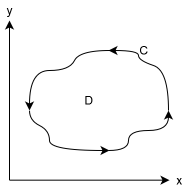
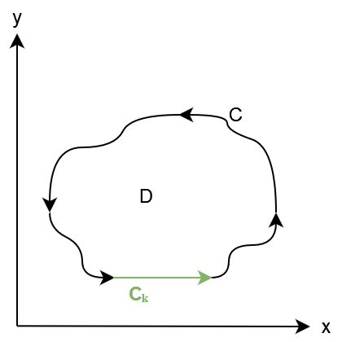
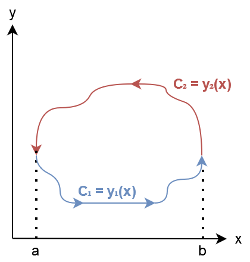
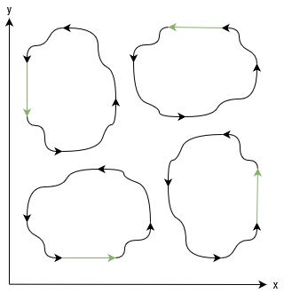

# 6 Greens Sats
Greens sats fanns inte med i 2019 boken, denna definition (och bevisinspiration) är tagen från wikipedia + khan academy.

> RE: kurvintegral def
> $\int_C f\ ds = \int_a^b f(r(t))||r'(t)||dt$
> där $ds = ||r'(t)||dt$
> där $r(t)$ är en parametrisering av $C$
>
> För 2D: $||r'(t)|| = \sqrt{(\frac{dx}{dt})^2+(\frac{dy}{dt})^2}$

> RE: Ytinegral def
> $\iint_S f\ dS = \iint_D f(r(x,y)) ||\frac{\partial r}{\partial x}(x,y) \times \frac{\partial r}{\partial y}(x,y)||dxdy$
där $ds = ||\frac{\partial r}{\partial x}(x,y) \times \frac{\partial r}{\partial y}(x,y)||dxdy$
>
> Och ytan:
> $A = \iint_D||\frac{\partial r}{\partial x}(x,y) \times \frac{\partial r}{\partial y}(x,y)||dxdy$

**Sats att bevisa:**
> $\int_C (Pdx + Qdy) = \iint_D (\frac{\partial P}{\partial x} - \frac{\partial Q}{\partial y})dxdy$
> Där $\int_C$ är en kurvintegral **motsols** längs med kantent av ytan $D$.
> Där $P, Q \in \mathbb{R}^2 \to \mathbb{R}$

## **Bevis**
Beviset delas upp i olika former

### **1) Konvex**
Låt oss börja med att bevisa greens för en konvex region utan lodräta eller vågräta linjer D med kurvan C. Jag kallar dessa former **klass A**.

$\int_C (Pdx + Qdy) = (\int_C Pdx) + (\int_C Qdy)$

### **1.1) Pdx**
Vi börjar med $\int_C Pdx$ och genom att kurvan i två delar som kan parametriseras av x (detta är varför kurvan måste vara konvex utan lodräta/vågräta linjer. Om så hade varit fallet hade fler än två delar behövts)

$\int_C P(x,y)dx = {\int_C}_1 P(x,y)dx + {\int_C}_2 P(x,y)dx$

$= \Big( \int_a^b P(x, y_1(x))dx \Big) + \Big( \int_b^a P(x, y_2(x))dx \Big)$
$= \Big( \int_a^b P(x, y_1(x))dx \Big) - \Big( \int_a^b P(x, y_2(x))dx \Big)$
$= \int_a^b \Big(P(x, y_1(x)) - P(x, y_2(x))\Big)dx$
$= -\int_a^b \Big(P(x, y_2(x)) - P(x, y_1(x))\Big)dx$
$= -{\large\int_a^b} \Big[P(x,y)\Big]_{y=y_1(x)}^{y=y_2(x)}dx$
Förutsatt att derivatan existerar är kan vi göra en en bekant substitution:
$= -{\large\int_a^b} \Big( {\large\int_{y_1(x)}^{y_2(x)}} \frac{\partial P}{\partial y} dy \Big)dx$
$= -{\large\int_a^b} {\large\int_{y_1(x)}^{y_2(x)}} \frac{\partial P}{\partial y} dydx$

Detta är en ytintegral, och ytan som integreras över ${\large\int_a^b}{\large\int_{y_1(x)}^{y_2(x)}}$ är lika med $D$.
> ⚠️ Detta funkar då vi tog ut inverterade integrationsgränserna och tog ut minus före uttrycket. ${\large\int_a^b} {\large\int_{y_2(x)}^{y_1(x)}}$ är **inte** samma som $D$!

$= -\iint_D \frac{\partial P}{\partial y} dydx$

### **1.2) Qdy**
Nu gör vi något liknande för $\int_C Qdy$
> ⚠️ $a,b,c_1,c_2$ har helt annan innebörd här!

$\int_C Q(x,y)dy = {\int_C}_1 Q(x,y)dy + {\int_C}_2 Q(x,y)dy$

$= \Big( \int_a^b Q(x_1(y), y)dy \Big) + \Big( \int_b^a Q(x_2(y), y)dy \Big)$
$= \Big( \int_a^b Q(x_1(y), y)dy \Big) - \Big( \int_a^b Q(x_2(y), y)dy \Big)$
$= \int_a^b \Big(  Q(x_1(y), y) - Q(x_2(y), y) \Big) dy$
$= {\large\int_a^b} \Big[Q(x,y)\Big]_{x=x_2(y)}^{x=x_1(y)}dy$
> ⚠️ Vi tar från $x_2 \to x_1$ inte $y_1 \to y_2$ som vi gjorde för $P$ så inget minus behövs!

Förutsatt att derivatan existerar är kan vi göra en en bekant substitution:
$= {\large\int_a^b} \Big( {\large\int_{x_2(x)}^{x_1(x)}} \frac{\partial Q}{\partial x} dx \Big)dy$
$= {\large\int_a^b} {\large\int_{x_2(x)}^{x_1(x)}} \frac{\partial Q}{\partial x} dxdy$

Detta är en ytintegral, och ytan som integreras över är igen lika med $D$

$= \iint_D \frac{\partial Q}{\partial x} dxdy$

### **1.3) Sätt ihop**
$\int_C (Pdx + Qdy) = (\int_C Pdx) + (\int_C Qdy)$
$= -\iint_D \frac{\partial P}{\partial y} dydx + \iint_D \frac{\partial Q}{\partial x} dxdy$
Då vi har tagit bort parametriseringen av $D$ är det ok att byta ordning på $dx$ och $dy$. (båda ordningar är lika med $dD$)
$= -\iint_D \frac{\partial P}{\partial y} dxdy + \iint_D \frac{\partial Q}{\partial x} dxdy$
Samma integrationsarea, så vi kan kombinera:
$= \iint_D \Big(-\frac{\partial P}{\partial y}+\frac{\partial Q}{\partial x} \Big) dxdy$
$= \iint_D \Big( \frac{\partial Q}{\partial x}-\frac{\partial P}{\partial y} \Big) dxdy$

Vilket är det vi ville bevisa!

### **2) Med raka linjer**
Låt oss nu bevisa greens för en liknande koveex form men nu har figuren en vågräta linje.
Igen: formen är D och den har motsolskurvan C. Jag kallar dessa former **klass B**.

Här har jag valt $C_k$ som den del av kurvan som är rak

> RE:
> $\int_C (Pdx + Qdy) = (\int_C Pdx) + (\int_C Qdy)$

### **2.1) Pdx**

$Pdx$ påverkas inte av det nya valet av form, parametriseringen går lika bra även denna gång.

Åter igen får vi:
$= -\iint_D \frac{\partial P}{\partial y} dydx$

### **2.2) Qdy**

$\int_C Qdx = \int_C Q(x,y)dy$
$= {\int_C}_1 Q(x,y)dy + {\int_C}_2 Q(x,y)dy + {\int_C}_3 Q(x,y)dy$

Då $y$ inte ändras längs $C_3$ är integationen längs denna sträcka lika med noll.
$\int_C Qdx = \int_C Q(x,y)dx = {\int_C}_1 Q(x,y)dy + {\int_C}_2 Q(x,y)dy$
$= {\int_C}_1 Q(x_a,y)dy + {\int_C}_2 P(x_b,y)dy$

$C_1$ och $C_2$ kan parametriseras lika dant som för formen utan en vågrät linje så uttrycket vi får
är igen identiskt med det för den konvexa icke lod/vågräta formen. Detta betyder att vi åter igen kommer landa i:
$= \iint_D \frac{\partial Q}{\partial x} dxdy$

### **2.3) Sätt ihop**
Då vi fick samma resultat av 2.2 och 2.3 som 1.2 och 2.3 får vi med identiskt resonemang:
$\int_C (Pdx + Qdy) = \iint_D \Big( \frac{\partial Q}{\partial x}-\frac{\partial P}{\partial y} \Big) dxdy$$

Med samma resonemang kan vi visa att green sats även stämmer för alla 90graders rotationer av klass B former.

### **3) Generallisering för alla ytor**
För en komplicerad figur kan man dela upp den i små delar och visa att green stämmer för alla delar individuellt.

Ta denna figur som exempel:

Och nu uppdelad i två klass B former.

Vi har redan bevisat att:
${\int_C}_{blå} (Pdx + Qdy) = {\iint_D}_{blå} (\frac{\partial P}{\partial x} - \frac{\partial Q}{\partial y})dxdy$
${\int_C}_{röd} (Pdx + Qdy) = {\iint_D}_{röd} (\frac{\partial P}{\partial x} - \frac{\partial Q}{\partial y})dxdy$

Och med hjälp av detta vill vi visa att:
${\int_C}_{svart} (Pdx + Qdy) = {\iint_D}_{svart} (\frac{\partial P}{\partial x} - \frac{\partial Q}{\partial y})dxdy$

⚠️ Vi förutsätter att $P$ och $Q$ (och dess yt/rand integraler) är definierat överallt längs och innuti formen!

### **3.1) Blå+Röd $\stackrel{?}{\Rarr}$ Svart**
Att summan av det blå och röda ytintegralen är det samma som den svarta är självklart, oavsett vilken funktion som integreras:
${\iint_D}_{svart} Fdxdy = {\iint_D}_{blå} Fdxdy + {\iint_D}_{röd} Fdxdy$

Är summan av randintegralerna av blå och röda är lika med den svara då?
${\int_C}_{svart} FdS \stackrel{?}{=} {\int_C}_{blå} FdS + {\int_C}_{röd} FdS$

Vi vet att:
${\int_C}_{svart} FdS = {\int_C}_{x} FdS + {\int_C}_{a} FdS$
${\int_C}_{blå} FdS = {\int_C}_{x} FdS + {\int_C}_{y} FdS$
${\int_C}_{röd} FdS = {\int_C}_{a} FdS + {\int_C}_{b} FdS$

Då $C_y$ och $C_b$ är exakt samma sträcka fast backlänges vet vi att:
${\int_C}_{b} FdS = -{\int_C}_{y} FdS$

Slutgiltigen sätter vi ihop det:
${\int_C}_{svart} FdS \stackrel{?}{=} {\int_C}_{blå} FdS + {\int_C}_{röd} FdS$
${\int_C}_{x} FdS + {\int_C}_{a} FdS \stackrel{?}{=} {\int_C}_{x} FdS + {\int_C}_{y} FdS + {\int_C}_{a} FdS + {\int_C}_{b} Fd$
${\int_C}_{x} FdS + {\int_C}_{a} FdS \stackrel{?}{=} {\int_C}_{x} FdS + {\int_C}_{y} FdS + {\int_C}_{a} FdS - {\int_C}_{y} Fd$
${\int_C}_{x} FdS + {\int_C}_{a} FdS \stackrel{?}{=} {\int_C}_{x} FdS + {\int_C}_{a} FdS$
${\int_C}_{x} FdS + {\int_C}_{a} FdS = {\int_C}_{x} FdS + {\int_C}_{a} FdS$ $\quad\square$

Vi har funnit att
${\int_C}_{svart} FdS = {\int_C}_{blå} FdS + {\int_C}_{röd} FdS$.

Altså:
${\iint_D}_{svart} Fdxdy = {\iint_D}_{blå} Fdxdy + {\iint_D}_{röd} Fdxdy$
${\int_C}_{svart} FdS = {\int_C}_{blå} FdS + {\int_C}_{röd} FdS$
Stämmer för alla $F$.

Således stämmer även:
${\int_C}_{svart} (Pdx + Qdy) = {\iint_D}_{svart} (\frac{\partial P}{\partial x} - \frac{\partial Q}{\partial y})dxdy$

Nu har vi visat att Greens även gäller för en form som man kan skära isär till två halvor där vardera halva är en Klass A/Klass B form.

Detta kan lätt bli ett induktionsbevis som visar att det gäller alla former, oavsett hur många gången man måste skära isär den. (Förutsatt att ett ändligt antal delningar leder till former som är klass A eller klass B)

### **3.2) Alla ytor?**

Det är enkelt att se att alla ytor kan konstrueras genom att skära isär dom till flera klass A/klass B figurer.

> Detta känns väldigt intuitivt men jag kommer inte på hur man formellt bevisar att så är fallet. Känns som det ligger utanför kursen?

### **4) Sammanfattning**

1) Vi har bevisat att greens sats gäller för alla former av klass A och klass B
2) Vi har motiverat att alla former kan skäras isär till klass A och klass B former
3) Vi har bevisat att green sats gäller för alla figurer som kan skäras isär till klass A och klass B former.
   - Vi har bevisat att för alla isärskurna figurer kommer summan av delformernas ytingegraler samma som den oskurna ytan.
   - Vi har bevisat att för alla isärskurna figurer kommer summan av delformernas randintegraler vara samma som den oskurna ytan.