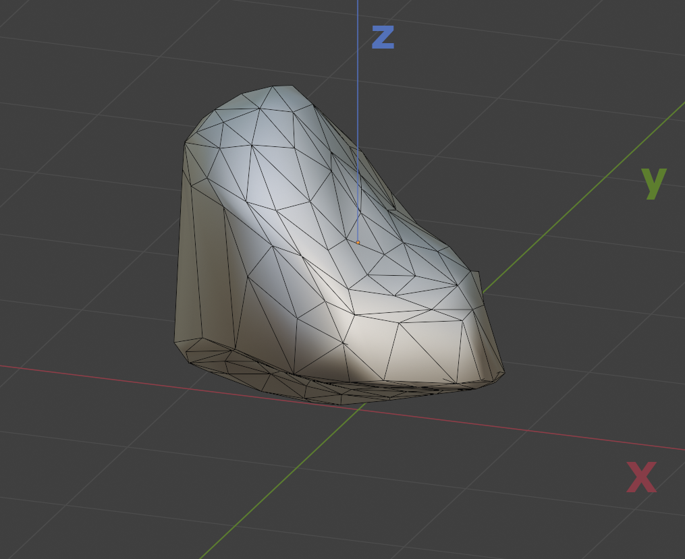

# 7 Gauss sats

> RE: Slät yta
> En yta S kallas slät (eller glatt) om det finns ett kontinuerligt varierande enhetsnrmalvektorfält i varje punkt på ytan. Med andra ord: det ska finnas en parametrisering så att:
> $$\hat{\bf N} = \pm \frac{r'_u \times r_v'}{||r'_u \times r_v'||}$$
> existerar (⇔ $r'_u \times r_v' \ne \bf 0$).
> Man kan då välja en orientering av ytan. Ytan är en *styckvis slät orienterad yta* om den är hopskarvat av släta orienterade ytor så att orienteringarna från båda sidor av skavaen stämmer överäns
> Obs. $\hat{\bf N}$ behöver inte vara definiera på skarven mellan ytorna.

**Sats att bevisa**
> $\iiint_D \nabla \cdot {\bf F}dV = \iint_S \hat{\bf N} \cdot {\bf F}dS$
> Där D är en begränsad mängd i ${\Bbb R}^3$ vars rand är en styckvis slät orienterad yta S med ett utåtriktat enhetsnormalvektorfält $\hat{\bf N}$.
> Där $\bf F$ är ett vektorfält med kontinuerlig derivata i D

## **Bevis**

Detta bevis kommer göras relativt likt Greens sats, med bevis för en "snäll" volym som sen generaliseras. Den region vi väljer är konceptuellt lik klass B regionen från green sats
(också kallad typ 1 region?)

Vi antar att vi har en form som oavsett vilken enhetsriktning man kollar ifrån kan delas upp i två (eller tre där den tredje är parallell med en enhetsvektor) delar så att vardera region kan parametriseras (eller den tredje vars integral blir 0, likt $C_k$ i Greens)

Exempel av typ 1 region.

### **1.1) Bryt ner $\iiint_D$ & $\iint_S$**
> RE:
> $\nabla \cdot {\bf F} = (\frac{\partial}{\partial x}, \frac{\partial}{\partial y}, \frac{\partial}{\partial z})\cdot(F_1, F_2, F_3) = \frac{\partial F_1}{\partial x} + \frac{\partial F_3}{\partial y} + \frac{\partial F_2}{\partial z}$

$\large \iiint_D \nabla \cdot {\bf F}dV$
$\large =\iiint_D (\frac{\partial F_1}{\partial x} + \frac{\partial F_2}{\partial y} + \frac{\partial F_3}{\partial z})dV$
$\large =(\iiint_D \frac{\partial F_1}{\partial x}dV) + (\iiint_D \frac{\partial F_2}{\partial y}dV) + (\iiint_D \frac{\partial F_3}{\partial z}dV)$

$\large \iint_S \hat{\bf N} \cdot {\bf F}dS$
$=\large \iint_S (\hat{\bf N}_1 F_1 + \hat{\bf N}_2 F_2 + \hat{\bf N}_3 F_3)dS$
$=\large (\iint_S \hat{\bf N}_1 F_1 dS) + (\iint_S \hat{\bf N}_2 F_2 dS) + (\iint_S \hat{\bf N}_3 F_3 dS)$

Skriver framöver med x/y/z subscript istället för 1/2/3 då jag finner det tydligare att följa.
$=\large (\iint_S \hat{\bf N}_x F_x dS) + (\iint_S \hat{\bf N}_y F_y dS) + (\iint_S \hat{\bf N}_z F_z dS)$

### **1.2) Inspektera $\iint_S \hat{\bf N}_z F_z dS$**

Jag börjar här med $\iint_S \hat{\bf N}_z F_z dS$ då dess regioner är lättast att att rita ut.

Börja med att dela upp $S$ i parametriserbara regioner:

$\iint_S \hat{\bf N}_z F_z dS = {\iint_S}_1 \hat{\bf N}_z F_z dS + {\iint_S}_2 \hat{\bf N}_z F_z dS +{\iint_S}_z \hat{\bf N}_z F_z dS$

Då riktningen av $S_3$ är ortagonal med z axeln, är $\hat{\bf N}_z$ alltid 0 här. Detta får följden att ${\iint_S}_3 \hat{\bf N}_z F_z dS$ också blir 0.

$\iint_S \hat{\bf N}_z F_z dS = {\iint_S}_1 \hat{\bf N}_z F_z dS + {\iint_S}_2 \hat{\bf N}_z F_z dS$

> ⚠️ om $S_3$ inte exsiterar (exempelvis om volymen är en boll) så gör det inget då ytintegralen av en tom region också är 0. Vi får fortfarande: $\iint_S \hat{\bf N}_z F_z dS = {\iint_S}_1 \hat{\bf N}_z F_z dS + {\iint_S}_2 \hat{\bf N}_z F_z dS$

### 1.2.1) parametrisering av S₁
Den konvexa formen av $S$ gör att vi kan parametrisera $S_1$ och $S_2$ så att:
$z_1 = f_1(x,y)$ för $S_1$
$z_2 = f_2(x,y)$ för $S_2$

${\iint_S}_1 \hat{\bf N}_z F_z(x, y, f_1(x,y)) dS$

> RE: 5.7 Ytintegral
> $\iint_S fdS = \iint_D f(r(u,v)) \Big\Vert \frac{\partial r}{\partial u}(u,v) \times \frac{\partial r}{\partial v}(u,v) \Big\Vert dudv$

> RE: 5.109
> $\hat{\bf N} = \LARGE\pm \frac{r'_u \times r_v}{\Vert r'_u \times r_v \Vert}$
>
> $\hat{\bf N} = \LARGE\pm \frac{\frac{\partial r}{\partial u}(u,v) \times \frac{\partial r}{\partial v}(u,v)}{\Vert \frac{\partial r}{\partial u}(u,v) \times \frac{\partial r}{\partial v}(u,v) \Vert}$
>
> Där valet av tecken innebär att vi väljer en orientering

Låt
$r(u,v) = (u, v, f_1(u,v))$

${\iint_S}_1 \hat{\bf N}_z F_z(x, y, f_1(x,y)) dS$
$= \large{\iint_D} F_z(r(u,v)) \left[\pm \frac{\frac{\partial r}{\partial u}(u,v) \times \frac{\partial r}{\partial v}(u,v)}{\Vert \frac{\partial r}{\partial u}(u,v) \times \frac{\partial r}{\partial v}(u,v) \Vert}\right]_z \Big\Vert \frac{\partial r}{\partial u}(u,v) \times \frac{\partial r}{\partial v}(u,v) \Big\Vert dudv$

$= \large{\iint_D} F_z(r(u,v)) \left[\pm \frac{\partial r}{\partial u}(u,v) \times \frac{\partial r}{\partial v}(u,v)\right]_z dudv$

$= \large{\iint_D} F_z(r(u,v)) \left[\pm \frac{\partial r}{\partial u}(u,v) \times \frac{\partial r}{\partial v}(u,v)\right]_z dudv$

> RE: kryssprodukt för z
> $c = a \times b$
> $c_z = a_x​b_y​−a_y​b_x​$

$r(u,v) = (u, v, f_1(u,v))$
$\frac{\partial r}{\partial u}(u,v) = (\frac{\partial u}{\partial u}, \frac{\partial v}{\partial u}, \frac{\partial f}{\partial u}) = (1,0, \frac{\partial f}{\partial u})$
$\frac{\partial r}{\partial v}(u,v) = (\frac{\partial u}{\partial v}, \frac{\partial v}{\partial v}, \frac{\partial f}{\partial v}) = (0,1, \frac{\partial f}{\partial v})$

$= \large{\iint_D} F_z(r(u,v)) \left(\pm \frac{\partial u}{\partial u}\frac{\partial v}{\partial v} - \frac{\partial v}{\partial u}\frac{\partial u}{\partial v} \right) dudv$
$= \large{\iint_D} F_z(r(u,v)) (\pm (1-0)) dudv$

väljer $u=x, v=y$ och att $D$ är projektionen av $S_1$ på $xy$ planet.

$= \large{\iint_D} F_z(x, y, f_1(x,y)) (\pm 1) dxdy$

Nu måste man vara försiktig när man väljer rätt $\pm$. $S_1$ är ovansidan av figuren, normalen bör därför peka i samma riktning som kryssprodukten mellan $\hat{\imath}$ (det vi satte valde som u) och $\hat{\jmath}$ (det vi satte valde som v). XYZ är högerhänt i bilden, således väljer vi den positiva varianten och med det samma riktining som $z$:

${\iint_S}_1 \hat{\bf N}_z F_z dS = \large{\iint_D} F_z(x, y, f_1(x,y)) dxdy$

### **1.2.2) Parametrisering av S**₂

Den enda skillnaden i konverteringen av $S_2$ gämfört med $S_1$ är vid valet av riktning av normalen.
Då $S_2$ är undersidan och pekar bort från positiva z riktningen. Vi får därför ett negativt uttryck.
${\iint_S}_2 \hat{\bf N}_z F_z dS = -\large{\iint_D} F_z(x, y, f_2(x,y)) dxdy$

### **1.2.3) Hela ytan**
Ytan $D$ vi får är samma för både $S_1$ och $S_2$

${\iint_S}_2 \hat{\bf N}_z F_z dS = \large{\iint_D} F_z(x, y, f_1(x,y)) dxdy-\large{\iint_D} F_z(x, y, f_2(x,y)) dxdy$

$= \large {\iint_D} \Big( F_z(x, y, f_1(x,y)) -F_z(x, y, f_2(x,y))\Big) dxdy$
Där $D$ är projektionen av $V$ (eller $S$) på $xy$ planet.

> ⚠️ Inte samma D som i trippelintegralen!

### 1.3) **Inspektera $\iiint_D \frac{\partial F_z}{\partial z}dV$**

$\iiint_D \frac{\partial F_z}{\partial z}dV$

På grund av formvalet vet vi att övre/undre ytan av $S$ går att parametriseras för $x,y$ kan vi uttrycka integrationen i två steg så att $z$ initialt är oberoende av att veta $x$ och $y$.

$=\iint_{D} \left( \int_{f_2(x,y)}^{f_1(x,y)} \frac{\partial F_z}{\partial z}dz \right) dydx$

> ⚠️ Inte samma D som i trippelintegralen!
> ⚠️ Vi ingererar från den lägre begränsningen $f_2$ (undersidan av figuren) till den högre $f_1$ (ovansidan av figuren)

Inuti parantesen kan vi använda fundmentalsatsen baklänges för att förenkla. (Efterssom vi tar integralen av derivatan)

$=\iint_{D} \left[ \frac{\partial F_z}{\partial z}dz \right]_{f_2(x,y)}^{f_1(x,y)} dydx$
$=\iint_{D} \left(F_z(x,y,f_1(x,y)) - F_z(x,y,f_2(x,y)) \right) dydx$

Detta är samma uttryck som för 1.2!

> ⚠️Dubbelintegralerna har samma $D$, det finns bara en yta det kan representera och det är den måste begränsas av samma $x,y$

### **1.4) Sammanfattning $F_z$**
$\large \iint_S \hat{\bf N}_z F_z dS = \iiint_D \frac{\partial F_z}{\partial z}dV$

### **2) Hur blir det för $F_x$ & $F_y$ ?**
För $F_x$ och $F_y$ går det stort sett kopiera samma resonemang som för $F_z$. Det jag ser värt att dubbelkolla är kryssprodukterna då dom kan bli annorluna beroende på axlar. Resonemang angångende trippelintegralen är oberoende av kryssprodukter.

### **2.1) Dubbelkolla $F_x$**

> RE: kryssprodukt för x
> $c = a \times b$
> $c_x = a_y​b_z​−a_z​b_y$

$r(u,v) = (f_1(u,v), u, v)$
$\frac{\partial r}{\partial u}(u,v) = (\frac{\partial f}{\partial u}, \frac{\partial u}{\partial u}, \frac{\partial v}{\partial u}) = (\frac{\partial f}{\partial u}, 1, 0)$
$\frac{\partial r}{\partial v}(u,v) = (\frac{\partial f}{\partial v}, \frac{\partial u}{\partial v}, \frac{\partial v}{\partial v}) = (\frac{\partial f}{\partial v}, 0, 1)$

$= \large{\iint_D} F_x(r(u,v)) \left[\pm \frac{\partial r}{\partial u}(u,v) \times \frac{\partial r}{\partial v}(u,v)\right]_x dudv$

$= \large{\iint_D} F_x(r(u,v)) \left(\pm \frac{\partial u}{\partial u}\frac{\partial v}{\partial v} - \frac{\partial v}{\partial u}\frac{\partial u}{\partial v} \right) dudv$
$= \large{\iint_D} F_x(r(u,v)) (\pm (1-0)) dudv$

Yes, kryssprodukten stämmer, samma resultat som för $F_z$

### **2.2) Dubbelkolla $F_y$**

> RE: kryssprodukt för y
> $c = a \times b$
> $c_y = a_zb_x​−a_x​b_z$

$r(u,v) = (u, f_1(u,v), v)$
$\frac{\partial r}{\partial u}(u,v) = (\frac{\partial u}{\partial u}, \frac{\partial f}{\partial u}, \frac{\partial v}{\partial u}) = (1, \frac{\partial f}{\partial u}, 0)$
$\frac{\partial r}{\partial v}(u,v) = (\frac{\partial u}{\partial v}, \frac{\partial f}{\partial v}, \frac{\partial v}{\partial v}) = (0, \frac{\partial f}{\partial v}, 1)$

$= \large{\iint_D} F_y(r(u,v)) \left[\pm \frac{\partial r}{\partial u}(u,v) \times \frac{\partial r}{\partial v}(u,v)\right]_y dudv$

$= \large{\iint_D} F_y(r(u,v)) \left(\pm \frac{\partial v}{\partial u}\frac{\partial u}{\partial v} - \frac{\partial u}{\partial u}\frac{\partial v}{\partial v} \right) dudv$
$= \large{\iint_D} F_y(r(u,v)) (\pm (0-1)) dudv$

Istället för $1$ blev kryssprodukten $-1$ men då vi väljer $\pm$ ser vi till att det pekar åt rätt håll.

⇒ Samma resultat som för $F_z$

> Footnote
> om man väljer $r(u,v) = (v, f_1(u,v), u)$ får man återigen $1$. Valet av vilken som mappas till $u$ eller $v$ ska inte spela roll.

### 3 Sammanfattning för "snälla" former:

$\large \iint_S \hat{\bf N} \cdot {\bf F}dS$
$=\large (\iint_S \hat{\bf N}_x F_x dS) + (\iint_S \hat{\bf N}_y F_y dS) + (\iint_S \hat{\bf N}_z F_z dS)$

$\large \iiint_D \nabla \cdot {\bf F}dV$
$\large =(\iiint_D \frac{\partial F_x}{\partial x}dV) + (\iiint_D \frac{\partial F_x}{\partial y}dV) + (\iiint_D \frac{\partial F_x}{\partial z}dV)$

$\large \iint_S \hat{\bf N}_x F_x dS = \iiint_D \frac{\partial F_x}{\partial x}dV$
$\large \iint_S \hat{\bf N}_y F_y dS = \iiint_D \frac{\partial F_y}{\partial y}dV$
$\large \iint_S \hat{\bf N}_z F_z dS = \iiint_D \frac{\partial F_z}{\partial z}dV$

$\implies \large \iint_S \hat{\bf N} \cdot {\bf F}dS = \large \iiint_D \nabla \cdot {\bf F}dV$
Vilket är det vi ville visa:

### **4) Generalisering för andra former**
Vi kommer nu se vad som händer när man delar på figuren för att se om:
Figur går att dela i "snälla" delar $\stackrel{?}{\implies}$ Gauss divergenssats håller för hela formen.

Låt oss ge ett vissuelt exempel:

(Bilden är tagen från wikipedia)

> ⚠️ för att passa med bilden används $V$ istället för $D$ för trippelintegralen.

> Observationer:
> $V = V_1 \cup V_2$
> $S = S_1 \cup S_2$
> ${\iiint_V} \nabla \cdot {\bf F}dV= {\iiint_V}_1 \nabla \cdot {\bf F}dV + {\iiint_V}_2 \nabla \cdot {\bf F}dV$

> Observationer ang. ytingegral (flux).
> $\phi_S = \iint_S \hat{\bf N} \cdot {\bf F}dS = \phi_1 + \phi_2$
>
> $\phi_{1}  = {\iint_S}_1 \hat{\bf N} \cdot {\bf F}dS$
> $\phi_{31} = {\iint_S}_3 \hat{\bf N} \cdot {\bf F}dS$
> $\phi_{2}  = {\iint_S}_2 \hat{\bf N} \cdot {\bf F}dS$
> $\phi_{32} = {\iint_S}_3 (-\hat{\bf N}) \cdot {\bf F}dS$
> (Normalen av $S_3$ är vara motsatt riktning från $V_1$, annars blir $V_2$ inte orienterad konsekvent)

Det som flöder ut från $V_1$ genom $S_3$ måste natruligtvis vara lika stort som det som flöder in till $V_2$ genom $S_3$
$\phi_{31} =  -\phi_{32}$
⇒
$\iint_S \hat{\bf N} \cdot {\bf F}dS = \phi_1 + \phi_{31} + \phi_2 + \phi_{32}$
$\iint_S \hat{\bf N} \cdot {\bf F}dS =$ Flödet genom väggarna av $V_1$ + flödet genom väggarna av $V_2$

### **4.1) Relatera tillbaks till divergenssatsen**
Säg att vi har delat en icke-snäll form till två snälla former, kan vi då visa att divergenssatsen funkar?

$\iint_S \hat{\bf N} \cdot {\bf F}dS \stackrel{?}{=} \large \iiint_V \nabla \cdot {\bf F}dV$

$\iint_S \hat{\bf N} \cdot {\bf F}dS \stackrel{?}{=} {\iiint_V}_1 \nabla \cdot {\bf F}dV + {\iiint_V}_2 \nabla \cdot {\bf F}dV$

Applicera divergensatsen för $V_1$ och $V_2$

$\iint_S \hat{\bf N} \cdot {\bf F}dS \stackrel{?}{=}
\left( {\iint_S}_1 \hat{\bf N} \cdot {\bf F}dS + {\iint_S}_3 \hat{\bf N} \cdot {\bf F}dS \right) +
\left( {\iint_S}_2 \hat{\bf N} \cdot {\bf F}dS + {\iint_S}_3 (-\hat{\bf N}) \cdot {\bf F}dS \right)$
$\iint_S \hat{\bf N} \cdot {\bf F}dS \stackrel{?}{=}
\left( {\iint_S}_1 \hat{\bf N} \cdot {\bf F}dS + {\iint_S}_3 \hat{\bf N} \cdot {\bf F}dS \right) +
\left( {\iint_S}_2 \hat{\bf N} \cdot {\bf F}dS - {\iint_S}_3 \hat{\bf N} \cdot {\bf F}dS \right)$
$\iint_S \hat{\bf N} \cdot {\bf F}dS \stackrel{?}{=}
{\iint_S}_1 \hat{\bf N} \cdot {\bf F}dS + {\iint_S}_2 \hat{\bf N} \cdot {\bf F}dS$

Dela upp $\phi_S$ i $\phi_1$ och $\phi_2$

${\iint_S}_1 \hat{\bf N} \cdot {\bf F}dS + {\iint_S}_2 \hat{\bf N} \cdot {\bf F}dS \stackrel{?}{=}
{\iint_S}_1 \hat{\bf N} \cdot {\bf F}dS + {\iint_S}_2 \hat{\bf N} \cdot {\bf F}dS$
${\iint_S}_1 \hat{\bf N} \cdot {\bf F}dS + {\iint_S}_2 \hat{\bf N} \cdot {\bf F}dS =
{\iint_S}_1 \hat{\bf N} \cdot {\bf F}dS + {\iint_S}_2 \hat{\bf N} \cdot {\bf F}dS$ $\quad\square$

⇒ om divergenssaten stämmer för båda halvorna stämmer den även för hela formen.

Nu har vi visat att Gauss divergenssats även gäller för alla form som kan skära isär till två halvor där vardera halva är en "snäll" form.

Detta kan lätt bli ett induktionsbevis som visar att det gäller alla former, oavsett hur många gången man måste skära isär den. (Förutsatt att ett ändligt antal delningar leder till att alla delar blir "snälla")

### **4.2) Kan allt delas?**
Igen, likt Greens kan jag inte komma på ett formellt bevis att alla former faktiskt kan skäras isär till "snälla" bitar. Det känns intutivt trots att det inte är lika glasklart att som i 2D.

Tar detta som något utanför kursen. Skulle vara kul att veta om det existerar något enkelt bevis.

### **5) Sammanfattning**

1) Vi har bevisat att Gauss divergenssats gäller för alla "snälla" former
2) Vi har motiverat att alla former kan skäras isär till "snälla" former
3) Vi har bevisat att Gauss divergenssats gäller för alla figurer som kan skäras isär till "snälla" former.

En snäll form är en konvex form som, för varje $x,y,z$ riktning, kan uppdelas i två (eller tre där den tredje är parallell med den valda riktningsvektorn) så att varje halva kan parametriseras utifrån de två resterande $x,y,z$.