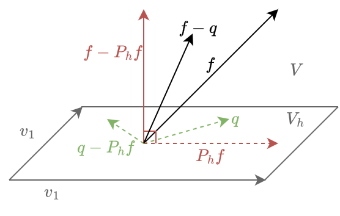

# 8 Basfunktionernas derivator

> RE: basfunktioner är ett set av funktioner som aproximerar
> $\left\{ \varphi_i \right\}^N_{i=1}$

**Sats att bevisa**

Derivatan av en basfunktion $\varphi = \hat{\varphi} \circ F_K^{-1}$ ges av:
$\nabla \varphi = (F'_K)^{-\top} \nabla_{\hat{x}} \hat{\varphi} \circ (F'_K)^{-1}$

För att vara utförlig vill vi egentligen visa att det stämmer för alla basfunktioner, men om vi visar att det stämmer för en generisk basfunktion kommer alla andra också funka.
$\forall \varphi \in \left\{ \varphi_i \right\}^N_{i=1}.\quad
\nabla \varphi = (F'_K)^{-\top} \nabla_{\hat{x}} \hat{\varphi} \circ (F'_K)^{-1}$

> RE:
> $\varphi(x) = \hat{\varphi}(F_K^{-1}(x))$
> Där $x$ är en punkt i rummet $\mathbb{R}^n$
> Där $\varphi$ är en av basfunktionen i det rummet vi vill undersöka ($\mathbb{R}^n \to \mathbb{R}^n$)
> Där $\hat{\varphi}$ är korresponderande basfunktionen i referensrummet ($\mathbb{R}^n \to \mathbb{R}^n$)
>
> $F_K^{-1}(x) = \hat{x}$ (och motsvarande $F_K(\hat{x}) = x$)
> $\hat{\varphi}(\hat{x}) = \varphi(x)$

**Bevis**

### **1) Dela upp i mindre delar**

> RE: expandering av $\nabla f(g(x))$
> $\nabla\big( f(g(x)) \big) = \left(
   {\Large\frac{\partial}{\partial x_1}} f(g(x)),\enspace
   {\Large\frac{\partial}{\partial x_2}} f(g(x)),\enspace\dots\enspace,
   {\Large\frac{\partial}{\partial x_n}} f(g(x))
\right)$

Sätt in $f = \hat{\varphi}$ och $g = F_K^{-1}$

$\nabla\varphi = \left(
   {\Large\frac{\partial}{\partial x_1}} \varphi(F_K^{-1}(x)),\enspace
   {\Large\frac{\partial}{\partial x_2}} \varphi(F_K^{-1}(x)),\enspace\dots\enspace,
   {\Large\frac{\partial}{\partial x_n}} \varphi(F_K^{-1}(x))
\right)$

### **2) Undersök $(\nabla\varphi)_i$**
$(\nabla\varphi)_i = {\Large\frac{\partial}{\partial x_i}} \varphi(x) = {\Large\frac{\partial}{\partial x_i}} \hat{\varphi}(F_K^{-1}(x))$

> RE: kedjeregeln för partiella
> ${\Large\frac{\partial}{\partial x_i}}f(g(x)) =
\displaystyle\sum_{i=1}^N {\frac{\partial f}{\partial y_i}}(g(x)) \cdot \frac{\partial g_j}{\partial x_i}$
> Där $g(x) = y$

Applicera kedjeregeln:
$= \displaystyle\sum_{j=1}^N
   {\frac{\partial\hat{\varphi}}{\partial {\large \hat{x}_j}} (F_K^{-1}(x))}
   \cdot
   {\frac{\partial(F_K^{-1})_j}{\partial {\large x_i}}}
$

> RE: jakobi
> $f'(x) = J_f(x) = Df(x) = \nabla f(x)$
>
> Exempel:
>> funktions defintion
>> $f \in \mathbb{R}^3 \to \mathbb{R}^2$
>
>> Alternativ ekvivalent definition:
>> $f(x) = y$
>> $x \in \mathbb{R}^3$
>> $y \in \mathbb{R}^2$
>
> $f' = \begin{bmatrix}
\frac{\partial f_1}{\partial x_1} & \frac{\partial f_1}{\partial x_2} & \frac{\partial f_1}{\partial x_3}
\\
\frac{\partial f_2}{\partial x_1} & \frac{\partial f_2}{\partial x_2} & \frac{\partial f_2}{\partial x_3}
> \end{bmatrix}$
>
> $\Large f'_{ij} = \frac{\partial f_i}{\partial x_j}$
>
> $\Large f'_{i} = \begin{bmatrix}
\frac{\partial f_i}{\partial x_1}&
\frac{\partial f_i}{\partial x_2}&
\frac{\partial f_i}{\partial x_3}
\end{bmatrix} = (f_i)'$
>
> $\Large (f'^\top)_{i} = \begin{bmatrix}
\frac{\partial f_1}{\partial x_i}&
\frac{\partial f_2}{\partial x_i}
\end{bmatrix}$

Substituera med jakobimatris
$= \displaystyle\sum_{j=1}^N
   \Big(
      \hat{\varphi}'(F_K^{-1}(x))
   \Big)_j
   \cdot
   (F_K^{-1})'_{ji}
$
> ⚠️ Notera att $\hat{\varphi}'$ är jacobimastrisen med avsende av $\hat{x}$ medans $(F_K^{-1})'$ är på avsende av vanliga $x$!

> RE: Kovertering mellan matrismultiplikation och summor
> $A \in \mathbb{R}^{m \times n}$, $B \in \mathbb{R}^{n \times w}$
>
> $(A \cdot B)_i = \displaystyle\sum_{k\in\mathbb{K}} A_{ik} \cdot B_{k}$
>
> motsvarande vid transponering (och $A \in \mathbb{R}^{n \times m}$ istället):
> $(A^\top \cdot B)_i = \displaystyle\sum_{k\in\mathbb{K}} A_{ki} \cdot B_{k}$

Summeringen kan göras om till en matrismultiplication

$(\nabla\varphi)_i = \left(
   \left(
      \left(
         F_K^{-1}
      \right)'
   \right)^\top
   \cdot
   \hat{\varphi}'
   \left(
      F_K^{-1}(x)
   \right)
\right)_i$

Skriv om med inversa funktionssatsen

> RE: Inversa funktionssatsen (enl. wikipedia)
> om $F(a) = b$ kan Jakobimatisen till $F^{-1}$ beräknas med:
> $(F^{-1})'(b) = (F'(a))^{-1}$

> RE:
> $F_K^{-1}(x) = \hat{x}$
> $F_K(\hat{x}) = x$

$(F_K^{-1})'(x) = (F_K'(\hat{x}))^{-1}$

$(\nabla\varphi)_i = \left(
   \left(F_K'\right)^{-\top}
   \cdot
   \hat{\varphi}'
   \left(F_K^{-1}(x)\right)
\right)_i$

> ⚠️ $\hat{\varphi}'$ är fortfarande jacobimastrisen med avsende av $\hat{x}$
men nu när vi har applicerat inversa funktionssatsen är $F_K'$ är nu också avsende av $\hat{x}$!

### **3) Undersök $\nabla\varphi$**

Vi har visat att följande stämmer för alla i
$(\nabla\varphi)_i = \left(
   \left(F_K'\right)^{-\top}
   \cdot
   \hat{\varphi}'
   \left(F_K^{-1}(x)\right)
\right)_i$

$\nabla\varphi =
   \left(F_K'\right)^{-\top}
   \cdot
   \hat{\varphi}'
   \left(F_K^{-1}(x)\right)
$

En sista substitution vi vill göra är att använda $\nabla$ notation istället för jakobi apostrof.

$\nabla\varphi =
   (F_K')^{-\top}
   \cdot
   \nabla_{\hat{x}}\varphi'
   (F_K^{-1}(x))
$
$\nabla\varphi = (F_K')^{-\top} \cdot \nabla_{\hat{x}}\varphi \circ F_K^{-1}$

Vilket är det vi ville bevisa!

> ⚠️ $F_K'$ är fortfarande jacobimastrisen med avsende av $\hat{x}$

$\nabla\varphi =
   (\nabla_{\hat{x}}F_K)^{-\top}
   \cdot
   \nabla_{\hat{x}}\varphi'
   (F_K^{-1}(x))
$

# 9 Satsen om bästa aproximation

**Sats att bevisa**
> Sats 5.2. Låt $V$ vara ett linjärt tum och $V_h \sub V$ ett underrunm. För varje $f$ i $V$ är den ortogonala projektioonen $P_hf$ den bästa aproximationen i $L^2$-normen, dvs.
> $||f- P_hf|| \le ||f-v||$
> för alla $v \in V_h$
>> *Inklusive när $v$ är den närmaste punkten i $V_h$ (Altså den bästa aproximationen)*

> RE:
> $P_h \in \mathbb{R}^{k\times k}$
> $f \in \mathbb{R}^{k\times 1}$

**Bevis**
### 1) Start
$||f-P_h||^2$
$= \braket{f-P_hf, f-P_hf}$
Lägg till ett godtyckligt fel $q$ i $V_h$
$= \braket{f-P_hf, f-q+q-P_hf}$

> RE:
> $\braket{A,B+C} = \braket{A,B} + \braket{A,C}$

$= \braket{f-P_hf, f-q} + \braket{f-P_hf, q-P_hf}$

### **2) Förenkla bort ortogonala**
Vad innebär detta uttryck? låt oss betrakta ett visuellt exempel i $\mathbb{R}^3$ där $V_h$ är ett underrum definierat som spannet av två vektorer $v_1$ och $v_2$.

### **2.1) Om $f \in V_h$**
Då får vi $P_hf = f$ och projektionsfelet blir $0$.
$\braket{f-P_hf, q-P_hf} = \braket{\bold{0}, q-P_hf} = 0$

### **2.2) Om $f \not\in V_h$**
Då $P_hf \in V_h$ och $f \not\in V_h$ måste $f-P_hf$ vara ortogonalt till $V_h$.
Då $q, P_hf \in V_h$ $\inplies$ $q-P_hf \in V_h$.
Då skalärprodukten av ortagonala vektorer är $0$ får vi:

$\braket{f-P_hf, q-P_hf} = 0$

### **3) Relatera tillbaka till frågan**
Genom 2.1 eller 2.2 får vi:

$\braket{f-P_hf, q-P_hf} = 0$

> ⚠️ Även om bildexemplet var för 3 dimensioner funkar textresonemanget för andra rum.

och således:
$||f-P_h||^2$
$=\braket{f-P_hf, f-q} + \underbrace{\braket{f-P_hf, q-P_hf}}_0$
$= \braket{f-P_hf, f-q}$

> RE: Cauchy–Schwarz olikhet
> $|\braket{a, b}|^2 \le \braket{a, a}\braket{b, b}$
> $|\braket{a, b}| \le ||a||\cdot||b||$

Applicera Cauchy–Schwarz olikhet
$\braket{f-P_hf, f-q} \le ||f-P_hf||\cdot||f-q||$
$||f-P_h||^2 \le ||f-P_hf||\cdot||f-q||$

Förenkla
$||f-P_h|| \le ||f-q||$

Då $q$ var en godtycklig punkt i $V_h$ får vi
$\forall q \in V_h.\quad ||f-P_h|| \le ||f-q||$

Vilket är det vi ville bevisa!.