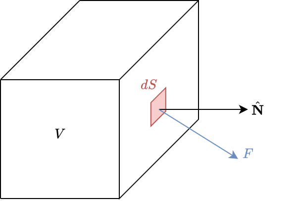

> RE: Sats Räkneregler för nabla
> $\nabla(fg) = \nabla(f)g + f\nabla(g)$
> $\nabla \cdot (f {\bf{F}}) = \nabla f \cdot {\bf{F}} + f \nabla \cdot {\bf{F}}$
> $\nabla \times (f {\bf{F}}) = (\nabla f) \times {\bf{F}} + f (\nabla \times {\bf{F}})$
> $\nabla \cdot (\nabla \times {\bf{F}}) = 0$
> $\nabla \times (\nabla f) = \bf{0}$


Från 4:
> RE: Konservativt fält medför opeoende av vägen
> Antal att vektorfältet $\bf{F}$ är konservativt med potential $\phi$ i en öppen och sammanhängande mänd $D$.
> Låt $C: r = r(t), t \in [a,b]$ vara en kurva i D. Då håller:
>
> $\int_C\bf{F} \cdot dr = \phi(r(b)) - \phi(r(a))$
>
> Detta innebär att integralen $\int_C\bf{F} \cdot dr$ är oberoende av vägen i $D$

> RE:
> Man kan säga att potentialen $\phi$ (om den finns) är ett slags "primitiv funktion" till $\bf{F}$. I fysik och mekanik brukar man skriva definitionen med ett minustecken: $\bf{F} = \nabla\phi$, så att $\bf{F}$ pekar dit där potentialen minskar mest.

Med detta i åtanke fattar jag frågan som:
**Givet att vi har ett konservativt fält, bevisa att det existerar en skalär potential**

givet:
$\int_C\bf{F} \cdot dr = \phi(r(b)) - \phi(r(a))$
där $C: r = r(t), t \in [a,b]$
bevisa:
$\bf{F} = \nabla\phi \quad$ i $D$

https://math.stackexchange.com/questions/4710934/why-does-vec-nabla-times-vec-f-0-mean-that-exists-phi-nabla-phi-ve
https://math.stackexchange.com/questions/638099/why-curl-free-field-implies-existence-of-potential-function


### **Bonus) Insikt i $\hat{\bf N} \cdot {\bf F}dS$**

$\hat{\bf N}$ är en vektor som är **utåtriktad** från volymens yta där riktningen är ortagonal med ytan.



Dela upp $F$ till det som är parallellt/ortagonalt med $\hat{\bf N}$

$\large \hat{\bf N} \cdot {\bf F}dS = \hat{\bf N} \cdot ({\bf F}_\parallel + {\bf F}_\perp) dS$
$= (\hat{\bf N} \cdot {\bf F}_\parallel + \hat{\bf N} \cdot {\bf F}_\perp) dS$

Skalärprodukten med en ortagonal vektor är alltid noll
$= \hat{\bf N} \cdot {\bf F}_\parallel dS$

$dS$ ytan är ortagonal till $\hat{\bf N}$ och ${\bf F}_\parallel$

DIVERGENS THEOREM:
```https://www.youtube.com/watch?v=DrRsXhln4S```


### EXXA


> Bonus: Verifiera att matrismultiplikationen blev rätt
> Subsitutation $F_K^{-1} = Q$
>> $\left(
   (\nabla Q)^\top
   \cdot
   \nabla_{\hat{x}}\hat{\varphi}
   \left(
      Q(x)
   \right)
\right)_i$
>
>$\nabla Q = \Large\def\arraystretch{1.5}\begin{bmatrix}
   \frac{\partial Q_1}{\partial x_1} & \frac{\partial Q_1}{\partial x_2} & \cdots & \frac{\partial Q_1}{\partial x_n}
   \\
   \frac{\partial Q_2}{\partial x_1} & \frac{\partial Q_2}{\partial x_2} & \cdots & \frac{\partial Q_2}{\partial x_n}
   \\
   \vdots & \vdots & \ddots & \vdots
   \\
   \frac{\partial Q_n}{\partial x_1} & \frac{\partial Q_n}{\partial x_2} & \cdots & \frac{\partial Q_n}{\partial x_n}
\end{bmatrix}$
>
>$\nabla_{\hat{x}}\hat{\varphi} = \Large\def\arraystretch{1.5}\begin{bmatrix}
   \frac{\partial \varphi_1}{\partial {\hat{x}}_1} & \frac{\partial \varphi_1}{\partial {\hat{x}}_2} & \cdots & \frac{\partial \varphi_1}{\partial {\hat{x}}_n}
   \\
   \frac{\partial \varphi_2}{\partial {\hat{x}}_1} & \frac{\partial \varphi_2}{\partial {\hat{x}}_2} & \cdots & \frac{\partial \varphi_2}{\partial {\hat{x}}_n}
   \\
   \vdots & \vdots & \ddots & \vdots
   \\
   \frac{\partial \varphi_n}{\partial {\hat{x}}_1} & \frac{\partial \varphi_n}{\partial {\hat{x}}_2} & \cdots & \frac{\partial \varphi_n}{\partial {\hat{x}}_n}
\end{bmatrix}$
>
>$(\nabla Q)^\top = \Large\def\arraystretch{1.5}\begin{bmatrix}
   \frac{\partial Q_1}{\partial x_1} & \frac{\partial Q_2}{\partial x_1} & \cdots & \frac{\partial Q_n}{\partial x_1}
   \\
   \frac{\partial Q_1}{\partial x_2} & \frac{\partial Q_2}{\partial x_2} & \cdots & \frac{\partial Q_n}{\partial x_2}
   \\
   \vdots & \vdots & \ddots & \vdots
   \\
   \frac{\partial Q_1}{\partial x_n} & \frac{\partial Q_2}{\partial x_n} & \cdots & \frac{\partial Q_n}{\partial x_n}
\end{bmatrix}$
>
>ex: rad $i = 1$ blir:

$\begin{bmatrix}
   \displaystyle\sum_{i=1}^n \frac{\partial \varphi_i}{\partial \hat{x}_1} \cdot \frac{\partial Q_i}{\partial x_1} &
   \displaystyle\sum_{i=1}^n \frac{\partial \varphi_i}{\partial \hat{x}_2} \cdot \frac{\partial Q_i}{\partial x_1} &
   \cdots &
   \displaystyle\sum_{i=1}^n \frac{\partial \varphi_i}{\partial \hat{x}_n} \cdot \frac{\partial Q_i}{\partial x_1}
\end{bmatrix}$

